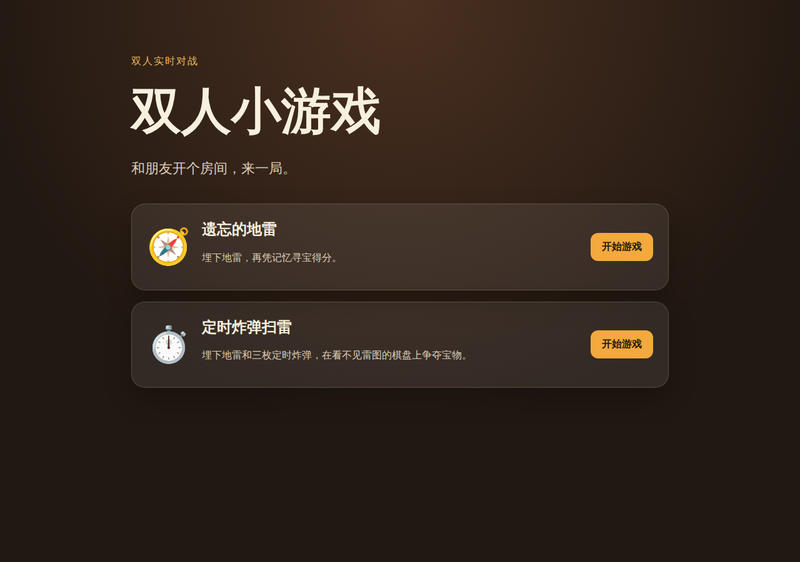
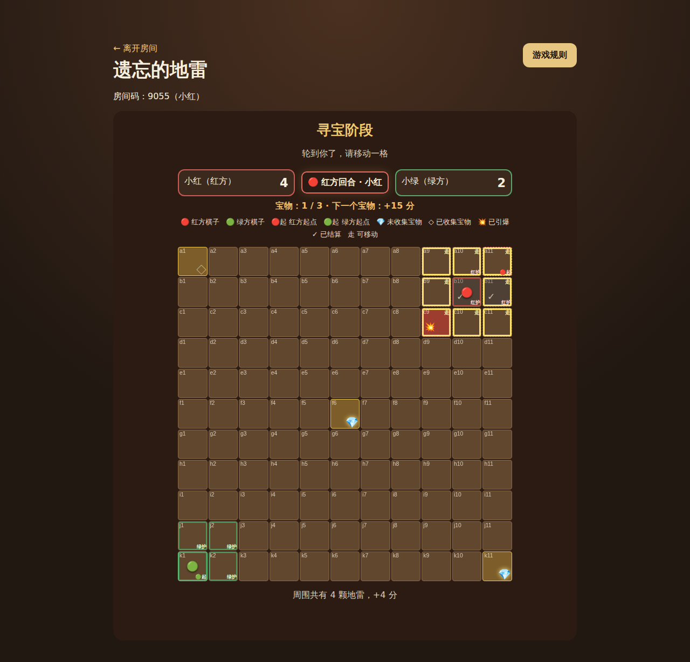

# 双人小游戏

和朋友开个房间，来一局。

当前游戏：

- **互坑扫雷**：双方为对手埋雷，同时扫雷，以实际用时加罚时决定胜负。
- **遗忘的地雷**：双方埋雷后忘掉雷图，轮流移动、避雷并争夺三个宝物。





## 在线游玩

在首页选择游戏，一位玩家创建房间并分享四位房间码，另一位玩家选择任意游戏卡后输入房间码加入；服务器会以房间记录的游戏为准。短暂断线或刷新会在 45 秒内使用本地会话 token 恢复原席位。终局后双方都点击“再来一局”，即可在同一房间开始该游戏的全新对局。

公开实例使用单个 Node.js 进程，因为房间和隐藏棋盘只保存在内存中。重新部署、进程重启或免费实例休眠会结束现有房间；当前版本不使用数据库、Redis 或多实例扩缩容。

## 本地运行与验证

要求 Node.js 20+。

```bash
npm ci
npm start
# 打开 http://localhost:8777

npm run lint
npm test
npm run test:e2e
npm run verify
```

Playwright 首次运行前执行 `npx playwright install --with-deps chromium`。`npm test` 包含 smoke、纯逻辑和真实 WebSocket 集成；`npm run test:e2e` 会启动临时服务器，以独立浏览器上下文测试两个玩家；`npm run verify` 运行完整发布门禁。

## 架构与安全

浏览器使用原生 HTML/CSS/JavaScript。`js/registry.js` 驱动首页卡片和游戏挂载，客户端游戏位于 `js/games/`。`server.js` 只管理通用房间、身份、重连和双票重开；`server/games/` 内的处理器拥有各自权威状态、动作校验、计时器和按席位公开序列化器。

客户端只提交意图，不提交分数、命中结果、位置、计时或胜负。互坑扫雷在终局前不发送对手雷区；遗忘的地雷在本人确认后连本人旧雷图也不再发送，只有服务器权威状态进入 `FINISHED` 后才公开双方完整原始雷图和踩爆归属供复盘。通用会话键 `two-player-games-session` 只保存房间码、席位、token、游戏 ID 和玩家名，绝不保存雷图。

完整协议与状态边界见 [架构说明](docs/ARCHITECTURE.md)，遗忘的地雷精确规则见 [规则决策](docs/FORGOTTEN_MINES.md)。

## 部署

GitHub Actions 对 pull request 和 `main` 分别执行 lint、Node 测试和 Chromium E2E。生产配置见 [DEPLOY.md](DEPLOY.md)，健康检查为：

```bash
curl -fsS https://<service>.onrender.com/health
```

可选参数包括 `HOST`、`PORT`、`RECONNECT_GRACE_MS`、`PLACEMENT_MS`、`FORGOTTEN_MINES_PLACEMENT_MS`、`FINISH_WINDOW_MS`、`WAITING_ROOM_TTL_MS`、`MAX_ROOMS` 和 `WS_HEARTBEAT_MS`。

## 添加新游戏

1. 在 `js/games/` 添加无 DOM 逻辑和注册模块，提供 `id`、`name`、`icon`、`description`、`howTo`、`create`。
2. 在 `server/games/` 添加服务端权威处理器，并在 `server.js` 的小型 handler map 注册。
3. 只通过显式按席位序列化器发送公开状态；隐藏信息不得在授权阶段前进入广播、重连、DOM 或浏览器存储。遗忘的地雷仅在 `FINISHED` 后把完整雷图作为明确的终局公开信息发送。
4. 添加纯逻辑、双 WebSocket 和双浏览器测试，并运行 `npm run verify` 与独立里程碑审查。

## 许可证

MIT，保留原项目署名。
